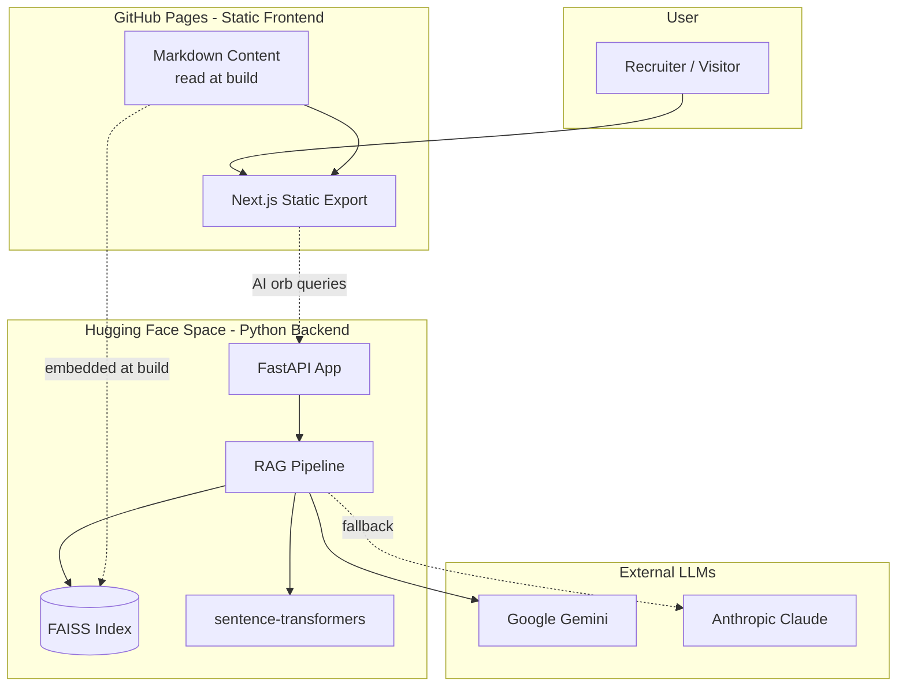

## Problem

Most dev portfolios fall into one of three traps:

1. **Templated** — recruiter sees 50 identical Brittany Chiang clones. Zero signal.
2. **Over-designed** — gorgeous landing, nothing technical behind it. Strong for designers, weak for engineers.
3. **Outdated** — last updated 2022, broken AI link, stale projects list. Active negative signal.

> EDIT: replace with your real motivation.

I wanted something that:

- Proves I can **ship** (the site itself is the proof)
- Proves I understand **AI deeply** (not just "I use ChatGPT" — a real RAG with retrieval evaluation)
- Stays **alive** (build-in-public learning trail + content that updates as I learn)
- Costs **$0/month** (recruiters shouldn't care about my AWS bill)

## What was built

A 3-layer interactive AI engineer universe:

- **Layer 1 (landing)** — cinematic minimal hero: silhouette in a glowing purple portal, "pull the thread" affordance, skippable boot sequence. Optimized for the 30-second recruiter impression. <100KB JS gzip.
- **Layer 2 (dashboard)** — discovered on scroll. Vault-door section cards, auto-scrolling tech chips, stats bar, floating "why hire me" card, rotating crystal AI orb with mocked chat, interactive terminal with easter eggs.
- **Layer 3 (deep dives)** — per-section pages: Projects (you're reading this), Experience, Architecture Lab, Travel, Skills, About. Long-scroll case studies with Mermaid architecture diagrams, sticky TOC, lazy-loaded heavy components.

Backed by:

- **Real RAG backend** — FastAPI on Hugging Face Spaces. sentence-transformers for embeddings, FAISS for vector search, Gemini Flash primary + Claude Haiku fallback, structured logging, rate limiting.
- **Markdown content layer** — every project, blog post, travel memory lives in `content/`. Same files feed both the frontend (build-time render via remark) AND the RAG backend (build-time embedding into FAISS).

## Your contribution

Solo end-to-end, including the design language and the build-in-public learning trail (`docs/ai-learning/`).

Specific calls I'm proud of:

- **Monorepo with Python at root.** `backend/` and `scripts/` (Python) at the repo root; `frontend/` as a subfolder. `ls` at root surfaces Python first. HF Space builds via a root `Dockerfile` that only copies the backend bits — `frontend/` stays out of the container automatically.
- **3-layer experience model.** Most portfolios cram everything onto the landing. I split into surface → dashboard → deep, with bundle budgets per layer (100KB / 250KB / 500KB gzip). Framer Motion lazy-loaded only when Layer 2 enters viewport.
- **Plug-and-play RAG.** Every layer (embedding model, vector store, LLM, knowledge loader) behind a Python ABC. Switching FAISS → ChromaDB or Gemini → Claude is one adapter file.
- **Hybrid color palette.** Layer 1 uses only restrained tokens (purple + cyan); Layer 2+ unlocks vivid (adds pink + magenta). Depth-on-scroll applied to color itself.
- **`prefers-reduced-motion` respected everywhere.** Boot auto-skips. Orb stops rotating. Chips stop marquee-ing. Animations degrade to no-op via media query + JS feature detect.

> EDIT: add anything you'd argue with a senior engineer about.

## Technology

| Layer | Choice | Why |
|---|---|---|
| Frontend framework | Next.js 16 (static export) | Highest UI ceiling for cinematic interactions; deploys to GitHub Pages as plain HTML |
| Styling | Tailwind 4 (CSS-first config) | Zero-config theming, atomic utilities, build-time purge |
| Animation | Framer Motion (lazy-loaded) | Only on Layer 2+; Layer 1 is CSS-only |
| Icons | lucide-react | Tree-shakable, ~1KB per icon, ISC license |
| Backend | FastAPI + uvicorn | Python-native async, perfect for ML deploys, fastest Python framework |
| Embedding model | `all-MiniLM-L6-v2` (sentence-transformers) | 22MB, 384-dim, fast on HF Space free tier |
| Vector store | FAISS (in-memory, persisted to file) | Fastest similarity search, no external service, $0 |
| LLM primary | Google Gemini 2.5 Flash | Free tier covers portfolio-scale traffic |
| LLM fallback | Anthropic Claude Haiku 4.5 | ~$0.25/M input tokens; only invoked on Gemini rate-limit |
| Frontend hosting | GitHub Pages | $0, public source = recruiter trust signal |
| Backend hosting | Hugging Face Spaces (free) | Python-native, ML community recognition, $0 |
| Content | Markdown + frontmatter (Zod-validated) | Source-of-truth for frontend + RAG backend |

## Architecture

Key decisions:

- **Static export over SSR** because GitHub Pages can't run Node. Tradeoff: no server-side data fetching at request time; we work around with build-time content + client-side RAG calls.
- **Separate backend on HF Space, not Vercel functions** because Python-native ML stack > TypeScript ML stack for recruiter signal AND for my own learning.
- **Single monorepo with Dockerfile filter** instead of two repos. Backend deploys filter-copy only `backend/`, `content/`, `shared/`, `requirements.txt` — no `frontend/` bloat in the running container.

## Outcome

> EDIT: replace with real numbers as the site matures.

- **$0/month hosting** — GitHub Pages + HF Space free tier. Designed to stay $0 to ~10K visitors/month.
- **Landing JS bundle: <100KB gzip** (Layer 1 budget hit on first build).
- **Total page weight (landing): <500KB** including hero portal SVG, fonts, and Tailwind CSS.
- **LCP <2s** on simulated slow 3G (Lighthouse).
- **3 fully-shipped layers** — Layer 1 (hero), Layer 2 (dashboard + mocked orb + terminal), Layer 3 Projects (you're here). More Layer 3 deep-dives in flight.
- **100% open source** — every line of code public on GitHub. Recruiters can verify authorship instantly.
- **AI learning trail** — `docs/ai-learning/` has 6 fully-written concept guides + 8 stage stubs. The trail itself is a recruiter signal: "this candidate learns in public."

## What I learned

**Engineering:**

- **Next.js 16 broke a lot of training data.** Conventions changed (static export config, App Router, RSC boundaries). Reading `node_modules/next/dist/docs/` BEFORE writing components saved hours of debugging.
- **Tailwind 4's CSS-first config is real.** No `tailwind.config.ts` — tokens live in `globals.css` under `@theme inline {}`. Smaller mental model.
- **HF Space free tier sleeps after 48h.** Cold-start is ~15s. The frontend has to surface this gracefully ("AI assistant is waking up...") or recruiters bounce.
- **Build-time content > runtime fetch.** Markdown rendered at build = zero parsing cost at request time + cleaner Lighthouse scores.

**Product:**

- **The 30-second test is real.** A senior recruiter spends 30s on first impression. The landing has to communicate "name + role + value prop" without scrolling.
- **Recruiters click "View Source" more often than expected.** Public repo with clean commits + readable code is itself a hire signal.

> EDIT: replace with what you actually learned. Especially the surprising stuff — that's the most compelling content.

## Links

- **Live:** [reddybytes.github.io](https://reddybytes.github.io)
- **Source:** [github.com/ReddyBytes/ReddyBytes.github.io](https://github.com/ReddyBytes/ReddyBytes.github.io)
- **AI learning trail:** [docs/ai-learning/ in the repo](https://github.com/ReddyBytes/ReddyBytes.github.io/tree/main/docs/ai-learning)
- **Architecture doc:** [docs/ARCHITECTURE.md](https://github.com/ReddyBytes/ReddyBytes.github.io/blob/main/docs/ARCHITECTURE.md)
