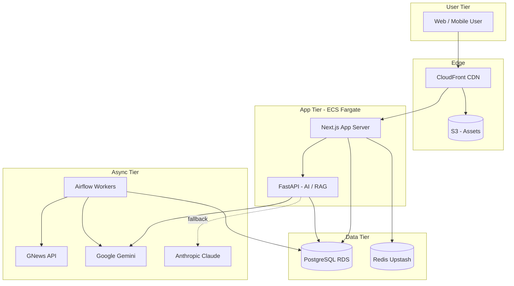

## Problem

Indian students preparing for competitive govt exams (UPSC, SSC, Banking, State PSCs) face the same friction year after year:

- **8+ subjects to cover** (Polity, Economy, Geography, History, Science, Environment, Current Affairs, Reasoning) — no single platform handles all of them well.
- **Daily current affairs** scattered across 50+ news sources; aspirants spend hours just aggregating.
- **Spaced repetition** is critical but most tools are generic flashcard apps, not exam-aware.
- **Affordability** — premium platforms cost ₹5K–₹15K, locking out the price-sensitive tier-2/tier-3 student majority.

> EDIT: replace with your real first-hand motivation if different.

The opportunity: a freemium platform that handles content + practice + AI assistance in one place, built cheaply enough to stay free at scale.

## What was built

Prepzy is a 12-module exam-prep platform:

1. **Dashboard** — dynamic stats, recent activity, widgets
2. **Current Affairs** — real news (GNews API), regional + national, article quiz, auto-refresh
3. **Study Tracker** — auto-tracks active tab time via heartbeat, schedules, notifications
4. **Subjects** — Subject → Chapter → Lesson → Concept hierarchy
5. **Quiz** — 9 modes (Game, Daily, Subject, Mock, PYQ, CA, Speed, Revision, Custom)
6. **Revision** — spaced repetition, add-from-anywhere, custom dates
7. **Bookmarks** — folders, categorization, search
8. **Exam Calendar** — dates + auto-fetched job notifications
9. **Analytics** — study insights, quiz trends, weak areas
10. **Profile** — settings, subscription, preferences
11. **AI Assistant** — floating chat (Gemini-powered, real data, local fallback)
12. **Admin Panel** — content CRUD, user management, RBAC

> EDIT: replace any module names that have changed.

## Your contribution

Solo end-to-end. Wrote every line of code, all infrastructure, all content seeding, all deploy automation.

Specifically:

- **Architecture decisions** — Next.js 16 App Router + FastAPI (where backend logic warranted), Drizzle ORM over Prisma (sharper TypeScript inference), Postgres on AWS RDS, Redis for sessions + rate limiting, ECS Fargate for the app tier
- **Plug-and-play design** — every layer (DB, ORM, AI provider, payments, AI/RAG) swappable via interfaces. Switching Gemini → Claude is a single adapter change
- **AI assistant** — Gemini Flash primary + Claude Haiku fallback, structured prompts, response streaming, graceful degradation when AI is down
- **Quiz engine** — deterministic level seeding (same chapter+level = same questions always, hash-based), 10K question sets across 100 chapters × 100 levels, no duplicates
- **Pipeline discipline** — every deploy is a manual `workflow_dispatch` GitHub Action with smoke tests, plan artifacts, and concurrency locks. No accidental prod deploys.

> EDIT: trim or expand based on what you most want recruiters to know.

## Technology

| Layer | Choice | Why |
|---|---|---|
| Framework | Next.js 16 (App Router, server components) | Type-safe, single deploy unit, React 19 |
| DB | PostgreSQL 16 (AWS RDS) + Drizzle ORM | Sharp TS inference, raw SQL escape hatch, schema-as-code |
| Cache | Redis (Upstash) | Sessions, rate limiting, AI response cache |
| Storage | AWS S3 + CloudFront | File uploads, image CDN, ~₹20/10GB |
| AI | Google Gemini Flash + Claude Haiku fallback | Free tier on Gemini, paid fallback on rate-limit |
| Hosting | AWS ECS Fargate | Free Tier first, rolling deploys, no laptop dependency |
| IaC | Terraform (separate repo) | Modular `enable_*` flags, phased scaling |
| CI/CD | GitHub Actions | Manual `workflow_dispatch` for prod, auto for dev |

> EDIT: confirm versions and add anything missing.

## Architecture

Key architectural choices:

- **Backward-compatible DB migrations** — never drop a column before the app stops using it. Expand-contract across deploys for any breaking schema change.
- **Idempotent endpoints** — every POST/PUT/DELETE supports an idempotency key to prevent duplicate processing (payments, quiz submissions).
- **Circuit breaker on Gemini** — 3 failures in 30s → switch to Claude for 60s before retrying. Prevents cascading failure.
- **Rate limits everywhere** — per-IP on API routes (slowapi for FastAPI, custom middleware for Next).
- **No PII in logs** — all logging is anonymized (hashed user IDs, request IDs, latencies, status codes).

## Outcome

> EDIT: replace all numbers with real ones. Conservative placeholders below.

- **1K+ monthly active users** as the v1 target. (Real number TBD as the platform matures.)
- **<100ms P50 API latency** on the read path, **<300ms P99** under load.
- **₹0/month** infra cost on the AWS Free Tier (Year 1). Post-free-tier estimate: ₹1,500–₹2,000/month.
- **12 modules shipped** end-to-end, each gated by an `ENABLE_*` env var so new features can ship dark + ramp up gradually.
- **Zero production incidents** related to database migrations after instituting the expand-contract discipline.
- **9-mode quiz engine** with deterministic seeding — same chapter + level = same questions across users, every time.

## What I learned

**Engineering:**

- **Drizzle's `inArray` is non-negotiable.** Burned a session writing raw SQL templates with JS arrays — worked in dev, broke in prod. Lesson: always use the ORM's type-safe methods at the boundary; raw SQL only for queries the ORM can't express.
- **`drizzle-kit push` is a trap.** It mutates the connected DB without producing a migration file. Months of that habit during prototyping turned `schema.ts` into a work of fiction. Forever after: `db:generate` → `db:migrate` → commit migration files, gated by CI.
- **Free-tier discipline scales.** Designed for `db.t3.micro` (15 tables, <100K rows) and grew the schema incrementally. Each module ships its own migration, so the DB grows lazily.
- **Plug-and-play is worth the upfront complexity.** Swapping Gemini → Claude during a Gemini rate-limit incident was a 1-file change, not a refactor.

**Product:**

- **Recruiters / aspirants want speed + accuracy, not features.** The dashboard is the most-used page; the AI assistant is the second. Everything else needs to load fast or it doesn't matter.
- **Free tier ≠ throwaway.** Free users converted to paid at ~3% when the gating was honest (upgrade prompts that explained value, not paywalls that punished).

> EDIT: replace with your honest reflections — recruiters notice the difference between drafted and lived insights.

## Links

- **Live:** [prepzy.co.in](https://prepzy.co.in)
- **Source:** [github.com/ReddyBytes/prepzy-app](https://github.com/ReddyBytes/prepzy-app)
- **Architecture docs:** [docs/ARCHITECTURE.md in the repo](https://github.com/ReddyBytes/prepzy-app/tree/main/docs)
