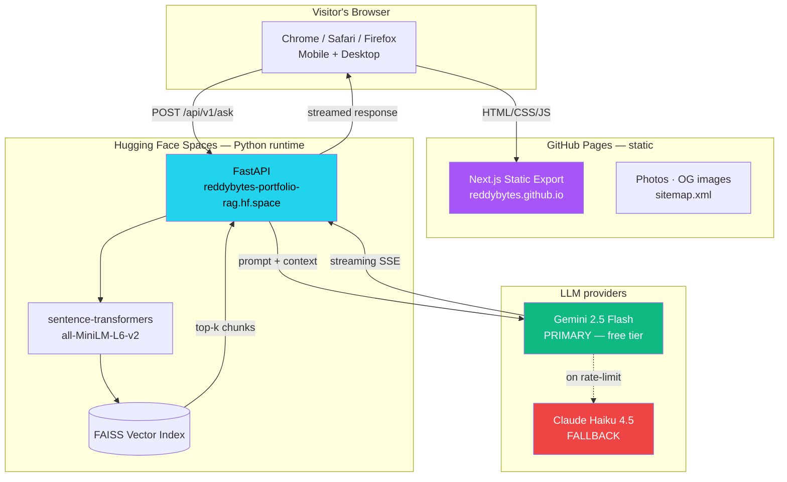
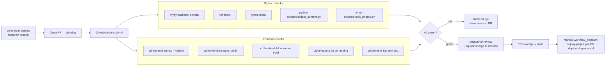
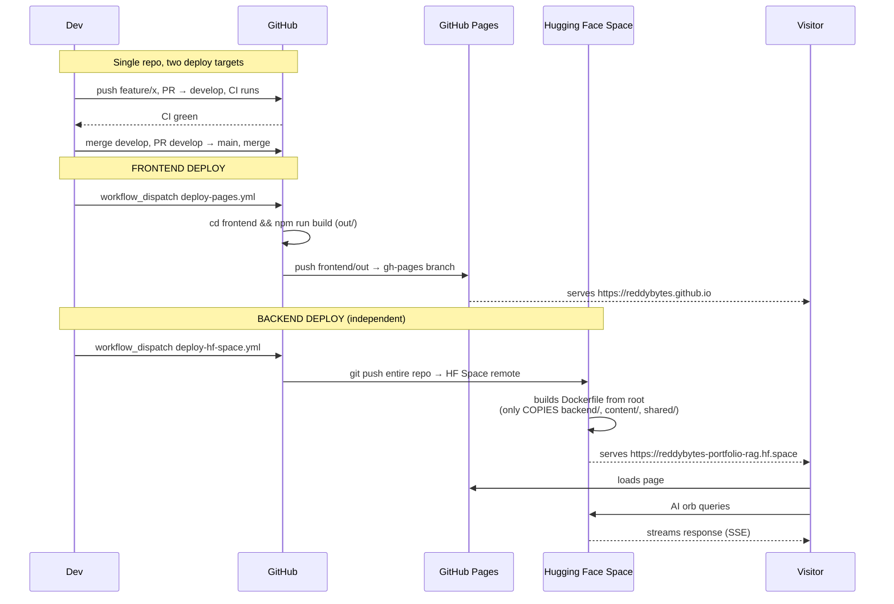

# Architecture

> Penchala Reddy's portfolio — futuristic AI-engineer site with cinematic minimal landing and depth-on-scroll discovery, powered by a real RAG-based AI assistant.

## Vision

This is NOT a portfolio website. It's an **interactive AI engineer universe** the recruiter DISCOVERS — minimal cinematic surface, dense engineering universe beneath. Every section unlocks through interaction, not just scroll. The backend is a real RAG pipeline (the floating AI orb), making the portfolio itself a portfolio piece.

**Audience priority (in order):**
1. Recruiters (30-second first impression, 5-min deep dive if interested)
2. Project showcase (Prepzy + future)
3. Personal brand + blog
4. Freelance / client acquisition

---

## The 3-layer experience model

The entire site is structured as three layers, each more detailed than the last. **Bundle inclusion, animation budget, content density, and color palette** are all tied to layer.

```
┌─────────────────────────────────────────────────────────────────┐
│ LAYER 1 — SURFACE (Landing / Above the fold)                    │
│ Minimal · Cinematic · One sentence · Silhouette in portal       │
│ Two CTAs · Subtle "Pull the thread" affordance                  │
│ Budget: <100KB JS · <2.5s LCP · CSS-only animation              │
│ Palette: RESTRAINED — purple + cyan + white on deep navy        │
└─────────────────────────────────────────────────────────────────┘
                              ↓ scroll / pull thread
┌─────────────────────────────────────────────────────────────────┐
│ LAYER 2 — DASHBOARD (Below the fold, ~600px down)               │
│ Jarvis HUD energy · Section cards · Tech chips · Stats          │
│ AI Assistant orb FIRST appears here                             │
│ Budget: <250KB cumulative · Framer Motion lazy-loaded           │
│ Palette: VIVID UNLOCKS — adds pink + magenta to landing palette │
└─────────────────────────────────────────────────────────────────┘
                              ↓ click section / unlock
┌─────────────────────────────────────────────────────────────────┐
│ LAYER 3 — DEEP DIVES (Per-route pages or modals)                │
│ Architecture Lab · Project vault doors · Travel world map       │
│ Train journey · Neural skill map · Full case studies            │
│ Budget: <500KB per route · Three.js OK · Heavy motion OK        │
│ Palette: FULL VIVID                                              │
└─────────────────────────────────────────────────────────────────┘
```

---

## System architecture



---

## Tech stack at a glance

| Layer | Tool | Why |
|---|---|---|
| Frontend framework | Next.js 16 (App Router, static export) | Best UI ceiling, free static hosting |
| UI | React 19 + Tailwind CSS 4 | Industry standard, fast iteration |
| Animation | Framer Motion (lazy) + Three.js (Layer 3 only) | Progressive enhancement |
| Content | Markdown + frontmatter (gray-matter + Zod) | Single source of truth, portable |
| Backend | FastAPI on Hugging Face Spaces | Python-native, free, ML-friendly |
| LLM primary | Google Gemini 2.5 Flash | Free 1500 req/day |
| LLM fallback | Anthropic Claude Haiku 4.5 | $0.25/M tokens |
| Embeddings | sentence-transformers `all-MiniLM-L6-v2` | Free, self-hosted, fast |
| Vector DB | FAISS (in-memory, persisted to file) | Free, fast, simple |
| CI | GitHub Actions | Free for public repos |
| Hosting (frontend) | GitHub Pages | Free, simple, public proof |
| Hosting (backend) | Hugging Face Spaces | Free, Python-native, AI signal |

Full stack reference with explanations per tool: see `Stack Reference` section in the global SKILL.md.

---

## Folder structure (monorepo — Python at root, Next.js in subfolder)

**Single repo, Python-prominent**: FastAPI app + scripts + content + shared schemas live at the root. Next.js lives in `frontend/`. This puts Python first visually and lets the HF Space deploy directly from the repo root via Dockerfile (no subtree push needed).

```
ReddyBytes.github.io/                # ONE repo for everything
│
├── backend/                              # FastAPI + RAG (Python) — at ROOT
│   ├── main.py                       # FastAPI entry + middleware
│   ├── config.py                     # Pydantic settings (env vars)
│   ├── routes/
│   │   ├── ask.py                    # POST /api/v1/ask — RAG endpoint
│   │   ├── scan.py                   # POST /api/v1/scan — personality scanner
│   │   └── health.py                 # GET /api/v1/health
│   ├── rag/                          # Plug-and-play interfaces
│   │   ├── pipeline.py               # RAGPipeline orchestrator
│   │   ├── embeddings/{base,sentence_transformers}.py
│   │   ├── vectorstore/{base,faiss_store}.py
│   │   ├── llm/{base,gemini,claude}.py
│   │   ├── loader/{base,markdown_local}.py    # reads /content directly (same repo)
│   │   └── guardian/{base,pii_filter,prompt_injection}.py
│   ├── middleware/{rate_limit,logging,cors}.py
│   ├── recruiter_modes.py            # Role-specific prompts
│   └── prompts.py                    # System prompt library
│
├── scripts/                          # Python build tooling — at ROOT
│   ├── check_photos.py               # Verify slots, log fallbacks
│   ├── validate_content.py           # Frontmatter schema check
│   ├── generate_sitemap.py
│   ├── build_knowledge_index.py      # Pre-embed → FAISS file
│   ├── og_image_generator.py         # PIL → static OG per page
│   └── scaffold/
│       ├── new_project.py
│       ├── new_travel.py
│       └── new_blog.py
│
├── content/                          # SHARED Markdown (RAG + frontend both read)
│   ├── about.md
│   ├── skills.md
│   ├── journey.md
│   ├── experience.md
│   ├── projects/{prepzy,...}.md
│   ├── travel/{slug}.md
│   └── blog/                         # Phase 3
│
├── shared/                           # SHARED schemas + types
│   └── schemas/
│       └── content.schema.json       # → Zod (frontend) + Pydantic (backend)
│
├── tests/                            # Python tests (pytest) at ROOT
│   ├── test_pipeline.py
│   ├── test_provider_swap.py
│   └── test_evaluation.py
│
├── data/                             # gitignored — RAG FAISS index, eval results
│   └── faiss_index.bin
│
├── evaluate.py                       # RAG eval runner at root
│
├── frontend/                         # Next.js (TypeScript) — subfolder
│   ├── src/
│   │   ├── app/                      # Next.js App Router
│   │   │   ├── layout.tsx
│   │   │   ├── page.tsx              # Landing (Layer 1)
│   │   │   ├── projects/[slug]/page.tsx
│   │   │   ├── about/page.tsx
│   │   │   ├── travel/page.tsx
│   │   │   ├── journey/page.tsx
│   │   │   ├── architecture-lab/page.tsx
│   │   │   └── blog/                 # Phase 3
│   │   ├── components/
│   │   │   ├── layer1/{HeroPortal,PullThread,BootSequence,SystemStatus}.tsx
│   │   │   ├── layer2/{SectionCards,TechChips,StatsBar,AIOrb,Terminal}.tsx
│   │   │   ├── layer3/{VaultDoor,TrainJourney,NeuralSkillMap,WorldMap,PersonalityScanner,ArchitectureCanvas}.tsx
│   │   │   └── shared/{Nav,Footer,ThemeToggle}.tsx
│   │   ├── lib/
│   │   │   ├── content/              # gray-matter + Zod (uses ../../shared/schemas)
│   │   │   ├── rag/                  # client → calls HF Space backend
│   │   │   ├── theme/                # tokens, isolation
│   │   │   ├── photo/                # fallback resolver
│   │   │   └── utils/
│   │   ├── styles/themes/
│   │   │   ├── dark/                 # v1
│   │   │   └── light/                # v2
│   │   └── hooks/
│   ├── public/photos/{profile,about,travel,defaults}/
│   ├── tests/                        # Vitest + Playwright
│   ├── package.json
│   ├── tsconfig.json
│   ├── next.config.js
│   └── tailwind.config.ts
│
├── docs/                             # Documentation (this folder)
│   ├── ARCHITECTURE.md (this file)
│   ├── DESIGN-SYSTEM.md
│   ├── RAG-BACKEND.md
│   ├── CONTENT-GUIDE.md
│   ├── AI-LEARNING-LOG.md
│   ├── DEPLOYMENT.md
│   ├── TROUBLESHOOTING.md
│   ├── NEXT-SESSION.md
│   ├── adr/                          # 0001-0006
│   ├── requirements/
│   └── references/
│
├── .github/
│   ├── CODEOWNERS
│   ├── dependabot.yml
│   ├── pull_request_template.md
│   └── workflows/
│       ├── ci.yml                    # Python (mypy + pytest) + Frontend (tsc + lint + lighthouse)
│       ├── deploy-pages.yml          # frontend/out → gh-pages
│       └── deploy-hf-space.yml       # whole repo → HF Space (Dockerfile filters)
│
├── Dockerfile                        # HF Space entry — only COPIES backend/, content/, shared/, requirements.txt
├── requirements.txt                  # Python deps at root
├── pyproject.toml                    # Python config (mypy, ruff, pytest)
├── .python-version                   # 3.11
├── .gitignore                        # Node + Python + macOS + secrets
├── LICENSE                           # MIT
├── README.md
├── CONTRIBUTING.md
└── SECURITY.md
```

### Dockerfile (root) — only ships backend bits to HF

```dockerfile
FROM python:3.11-slim

WORKDIR /app

# Only copy what the backend needs — frontend/ stays out of the image
COPY requirements.txt .
RUN pip install --no-cache-dir -r requirements.txt

COPY backend/ ./backend/
COPY content/ ./content/
COPY shared/ ./shared/

EXPOSE 7860
CMD ["uvicorn", "backend.main:app", "--host", "0.0.0.0", "--port", "7860"]
```

When you push to HF Space, HF builds this Dockerfile from repo root. The `frontend/` folder is in the git push but NOT in the running container — clean separation without subtree splitting.

---

## Build pipeline (monorepo)



## Deployment flow (two targets, one repo)



**Two independent deploys from one repo** — frontend can ship without backend touching anything, and vice versa. Each has its own `workflow_dispatch` trigger.

---

## Key decisions

| ADR | Decision | One-line why |
|---|---|---|
| [0001](./adr/0001-nextjs-frontend-fastapi-backend.md) | Next.js frontend + FastAPI backend | Best UI ceiling + Python-native AI |
| [0002](./adr/0002-gh-pages-plus-hf-spaces.md) | GitHub Pages + Hugging Face Spaces | Free + simple + AI-community signal |
| [0003](./adr/0003-three-layer-experience-model.md) | 3-layer surface→dashboard→deep | Minimal landing, depth unfolds with intent |
| [0004](./adr/0004-hybrid-color-palette.md) | Hybrid landing/deep color palette | Depth-on-scroll applied to color itself |
| [0005](./adr/0005-gemini-primary-claude-fallback.md) | Gemini primary, Claude Haiku fallback | Free + resilient, no OpenAI |
| [0006](./adr/0006-monorepo-python-prominent.md) | Monorepo with Python at root | One repo for both stacks, Python-first identity |

---

## Cheat sheet — what lives where

| Concern | Location |
|---|---|
| FastAPI backend | `backend/` |
| RAG pipeline | `backend/rag/pipeline.py` |
| Plug-and-play interfaces | `backend/rag/*/base.py` |
| Python build scripts | `scripts/` |
| Content scaffolders | `scripts/scaffold/` |
| Markdown content (shared) | `content/` |
| Shared schemas | `shared/schemas/` |
| Python tests | `tests/` |
| Eval set + runner | `data/recruiter_questions.json` + `evaluate.py` |
| Next.js frontend | `frontend/src/` |
| Frontend design tokens | `frontend/src/lib/theme/tokens.ts` |
| Frontend theme CSS | `frontend/src/styles/themes/dark/` |
| Photo fallback resolver | `frontend/src/lib/photo/fallback.ts` |
| Photo files | `frontend/public/photos/<section>/` |
| Photo defaults (SVGs) | `frontend/public/photos/defaults/` |
| RAG client (frontend) | `frontend/src/lib/rag/client.ts` |
| Docs | `docs/` |
| ADRs | `docs/adr/` |
| HF Dockerfile | `Dockerfile` (repo root) |
| Python deps | `requirements.txt` (repo root) |
| Python config | `pyproject.toml` (repo root) |
| Live frontend | `https://reddybytes.github.io` |
| Live backend | `https://reddybytes-portfolio-rag.hf.space` |
