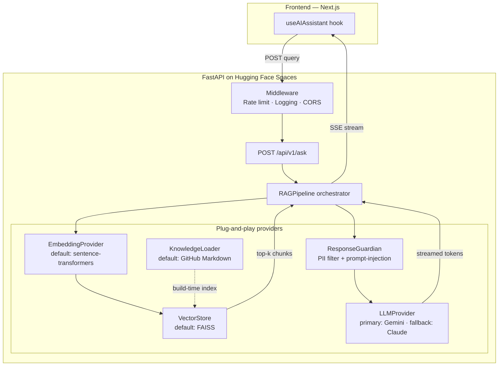

# RAG Backend

The FastAPI service on Hugging Face Spaces that powers the AI assistant orb, terminal commands, and personality scanner. **Plug-and-play architecture**: every layer (LLM, embeddings, vector DB, knowledge loader, response guardian) swappable via interface.

> **Treat this build as a learning project.** See `AI-LEARNING-LOG.md` for the 9-stage tuning curriculum.

---

## Architecture



---

## API endpoints

| Method | Path | Purpose | Auth |
|---|---|---|---|
| POST | `/api/v1/ask` | RAG Q&A (streamed) | None — rate limited per IP |
| POST | `/api/v1/scan` | Personality scanner (deterministic metrics) | None — rate limited per IP |
| GET | `/api/v1/health` | Liveness probe (uptime, FAISS loaded, LLM reachable) | None |
| POST | `/api/v1/reindex` | Manual rebuild of knowledge index | Bearer token (admin) |

### Request: `/api/v1/ask`

```json
{
  "query": "What's your strongest Python experience?",
  "mode": "default | backend | ai_ml | platform",
  "session_id": "abc123"  // optional, for conversation context
}
```

### Response: streamed Server-Sent Events

```
data: {"type": "thinking", "message": "Searching knowledge base..."}
data: {"type": "chunks", "sources": ["projects/prepzy.md", "skills.md"]}
data: {"type": "token", "text": "Penchala "}
data: {"type": "token", "text": "is "}
...
data: {"type": "done", "total_tokens": 142, "latency_ms": 1240}
```

---

## Knowledge sources (the RAG's brain)

Pulled at build/reindex time from the `content/` folder of `reddybytes.github.io` (via GitHub API):

| Source | Pattern | Audience tag |
|---|---|---|
| About | `content/about.md` | all |
| Skills | `content/skills.md` | recruiter, ai_ml |
| Journey | `content/journey.md` | recruiter |
| Experience | `content/experience.md` | recruiter |
| Projects | `content/projects/*.md` | recruiter, showcase |
| Travel | `content/travel/*.md` | brand |
| Resume | `content/resume.md` | recruiter (when added) |
| Blog | `content/blog/*.md` | brand (Phase 3) |
| GitHub | API: pinned repos + READMEs | recruiter, showcase |

### Frontmatter schema (enforced)

```yaml
---
title: "Prepzy — Govt Exam Prep Platform"
slug: prepzy
type: project          # project | travel | blog | experience | about
audience: [recruiter, showcase]
weight: 10             # 1-10, higher = more prominent in retrieval
tags: [python, ai, kubernetes, airflow, postgres, nextjs]
github: https://github.com/ReddyBytes/prepzy-app
demo: https://prepzy.co.in
status: published      # draft | published — drafts NOT indexed
indexed: true          # set false to exclude from RAG entirely
created: 2026-01-15
updated: 2026-05-26
---
```

Drafts (`status: draft`) excluded from both site build AND RAG index.

---

## Plug-and-play interfaces

Every layer is a Python `Protocol` (interface). Pipeline orchestrator never imports concrete implementations.

```python
# backend/rag/embeddings/base.py
from typing import Protocol

class EmbeddingProvider(Protocol):
    def embed(self, texts: list[str]) -> list[list[float]]: ...
    def dim(self) -> int: ...

# backend/rag/vectorstore/base.py
class VectorStore(Protocol):
    def add(self, embeddings: list[list[float]], metadata: list[dict]) -> None: ...
    def search(self, query: list[float], k: int) -> list[tuple[float, dict]]: ...
    def persist(self, path: str) -> None: ...
    def load(self, path: str) -> None: ...

# backend/rag/llm/base.py
class LLMProvider(Protocol):
    async def stream(self, prompt: str, max_tokens: int) -> AsyncIterator[str]: ...
    def name(self) -> str: ...
```

### Swap test (mandatory)

`tests/test_provider_swap.py` verifies any provider can be replaced with a mock without changing pipeline code:

```python
def test_pipeline_works_with_mock_llm():
    pipeline = RAGPipeline(
        embedding=MockEmbedding(),
        vectorstore=MockVectorStore(),
        llm=MockLLM(),
        loader=MockLoader(),
        guardian=PassThroughGuardian(),
    )
    assert pipeline.ask("test") == "mocked response"
```

---

## Recruiter modes

Specialized system prompts per role (set via `mode` field in `/ask`):

```python
ROLE_PROMPTS = {
    "default": "You are Penchala's AI assistant. Answer concisely with sources.",
    "backend": "Focus on Python, FastAPI, Airflow, Kubernetes, system design...",
    "ai_ml": "Focus on RAG, embeddings, LangChain, LLM apps, ML pipelines...",
    "platform": "Focus on infrastructure, deployments, observability, scaling...",
}
```

UI exposes these as quick-action buttons on the AI orb.

---

## Cold-start UX (CRITICAL)

Free HF Space sleeps after 48h. Wake takes 15-30s. The frontend MUST handle this gracefully:

1. **Frontend health-check on page load** — `GET /api/v1/health` (non-blocking)
2. **If health-check 503 / timeout** — show "AI assistant is waking up... (~15s)" animation
3. **Retry every 3s** with backoff
4. **When awake** — orb pulses ready
5. **NEVER** show a generic loading spinner — always communicate cold-start specifically

```typescript
// src/lib/rag/client.ts
async function ensureBackendAwake(): Promise<void> {
  while (true) {
    try {
      const res = await fetch(`${BACKEND_URL}/api/v1/health`, { signal: timeout(3000) })
      if (res.ok) return
    } catch {}
    setOrbState('waking-up')
    await sleep(3000)
  }
}
```

---

## Security + abuse prevention

### Rate limiting (slowapi)
- 10 requests/minute per IP
- 100 requests/day per IP
- Burst of 3 allowed
- Beyond limits → 429 with `Retry-After` header + cached FAQ as fallback

### Prompt injection prevention
- System prompt isolated from user input (NEVER concatenated raw)
- User query passed as a separate role/message
- Output guardian strips any URL not in allowlist
- Output guardian refuses if response contains code execution / shell commands

### PII filter
- Never echo email, phone, address back to user even if asked
- Recruiter analytics logged ANONYMOUSLY (hashed IP + query topic, NOT raw query)

### Logging
```json
{
  "requestId": "01HZX...",
  "route": "/api/v1/ask",
  "ip_hash": "sha256(...)",
  "mode": "backend",
  "latency_ms": 1240,
  "tokens_in": 89,
  "tokens_out": 142,
  "llm": "gemini-2.5-flash",
  "status": 200,
  "timestamp": "2026-05-26T10:30:00Z"
}
```

---

## LLM fallback chain

```python
# backend/rag/llm/__init__.py
class LLMRouter:
    async def stream(self, prompt: str) -> AsyncIterator[str]:
        try:
            async for token in self.gemini.stream(prompt):
                yield token
        except (RateLimitError, ServiceUnavailable):
            log.warning("Gemini failed, falling back to Claude")
            async for token in self.claude.stream(prompt):
                yield token
        except Exception as e:
            log.error("Both LLMs failed", exc_info=e)
            yield "I'm having trouble right now. Please check the projects section directly."
```

---

## Tuning playbook (high-level summary)

The RAG is treated as a 9-stage learning project. **Do NOT ship without going through every stage.** Each stage produces a measurable improvement; document learnings in `AI-LEARNING-LOG.md`.

| Stage | Focus | Time |
|---|---|---|
| 1 | Concepts (NO code) — embeddings, chunking, vector DB, retrieval, hallucination | 1 day |
| 2 | Minimal end-to-end (~30 lines, no UI) | 1 day |
| 3 | Eval set (30 recruiter questions, baseline P@k) | 1 day |
| 4 | Chunking experiments (256/512/1024, semantic, hierarchical) | 1-2 days |
| 5 | Embedding model experiments (MiniLM → MPNet → BGE) | 1-2 days |
| 6 | Re-ranking (cross-encoder for top-5) | 1-2 days |
| 7 | Prompt + temperature + few-shot tuning | ongoing |
| 8 | Recruiter modes (per-role specialized prompts) | 1 day |
| 9 | Production hardening (rate limits, cache, cold-start, streaming, eval-in-CI) | 1 day |

See `AI-LEARNING-LOG.md` for detailed playbook.

---

## Future evolution (Phase 3+)

- **Fine-tune embeddings** on portfolio content (contrastive learning on (Q, correct-chunk) pairs)
- **LoRA fine-tune a small LLM** (Llama-3.2-1B) for Penchala-voice responses — runs on HF Space T4 if upgraded
- **Hybrid search** — vector + BM25 for rare-term recall (specific tech names)
- **Query rewriting** — LLM expands query before retrieval
- **Conversational memory** — session-scoped multi-turn context
- **Self-RAG / iterative retrieval** — LLM decides if it needs more chunks

---

## Where things live

| Concern | Location |
|---|---|
| API routes | `backend/routes/` |
| Pipeline orchestrator | `backend/rag/pipeline.py` |
| Provider interfaces | `backend/rag/*/base.py` |
| Concrete implementations | `backend/rag/*/[name].py` |
| System prompts | `backend/prompts.py` |
| Recruiter modes | `backend/recruiter_modes.py` |
| Rate limit middleware | `backend/middleware/rate_limit.py` |
| Logging middleware | `backend/middleware/logging.py` |
| Eval set | `data/recruiter_questions.json` |
| Eval runner | `evaluate.py` |
| FAISS persistence | `data/faiss_index.bin` (gitignored) |
| Env vars (`.env.example`) | Repo root |
