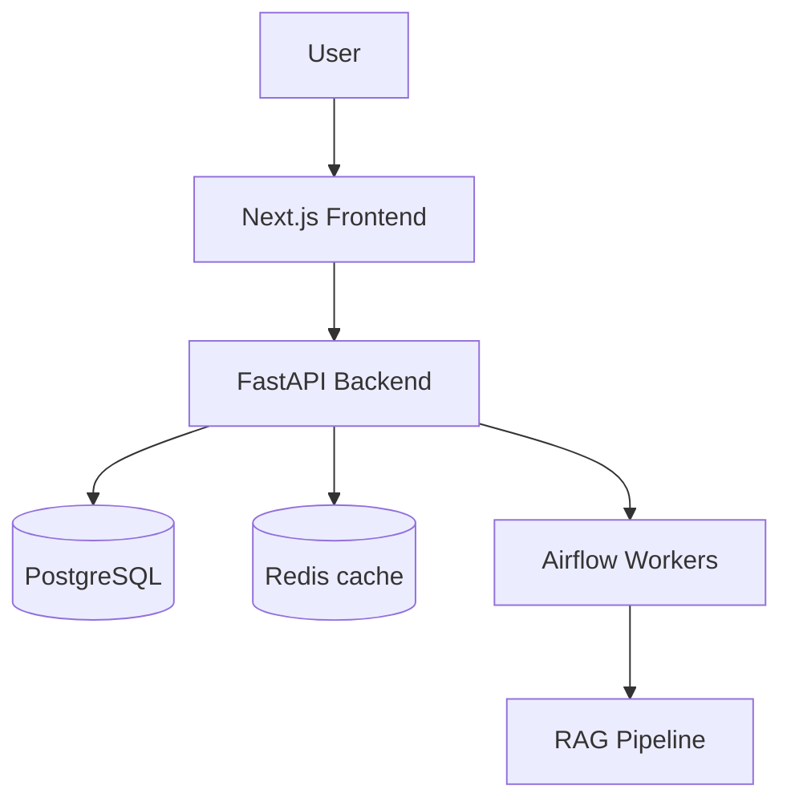

# Layer 3 — Projects Design Spec

> Locked design contract for the Layer 3 Projects deep-dive (the page recruiters land on when they click **SEE MY WORK** / Projects vault card). All decisions captured 2026-05-26 via 3 batches of design questions.

> See [`docs/design/LAYER1.md`](./LAYER1.md), [`docs/design/LAYER2.md`](./LAYER2.md), [`docs/ARCHITECTURE.md`](../ARCHITECTURE.md), [`docs/DESIGN-SYSTEM.md`](../DESIGN-SYSTEM.md).

---

## Goal of Layer 3 Projects

Layer 1 = first impression. Layer 2 = exploration. **Layer 3 Projects = the conversion page.** A recruiter who clicked here is interested; this is where they form a hire/no-hire signal.

It must:

1. Prove shipped work — not theoretical, not "side projects"
2. Show architecture thinking — not just "I used X"
3. Quantify impact — users, perf wins, scale, $$
4. Be skim-friendly (recruiter reads first card in 30s) AND deep-readable (engineer reads case study in 5min)
5. Link to verifiable proof — GitHub repos, live demos
6. Set up Layer 3 patterns reused by future deep-dives (Experience, Architecture Lab, Travel, Skills, About)

**v1 scope**: 2 fully-written case studies — **Prepzy** + **this portfolio**. Real metrics, real architecture, real GitHub.

---

## Page architecture

Two route levels:

```
/projects                    INDEX — magazine layout, 1 featured + 1 secondary
/projects/[slug]             CASE STUDY — long-scroll, 8 sections + sticky TOC

/projects/prepzy             "Prepzy — Govt exam prep at scale"
/projects/portfolio          "This portfolio — Python-powered AI engineer site"
```

Both routes are static-exported via `generateStaticParams()` (every slug pre-rendered at build).

---

## Component breakdown

### Index page (`/projects`)
1. **PageHeader** — eyebrow + title + tagline (reused for all Layer 3 pages)
2. **FeaturedProject** — large hero card with screenshot, tagline, 3 tech tags, "Read case study →" link
3. **SecondaryProject** — smaller card below, same anatomy but compressed

### Per-project page (`/projects/[slug]`)
4. **ProjectHero** — title + tagline + hero image + 4 quick metadata pills (tech, role, when, status) + 2 CTAs (Live demo + GitHub)
5. **CaseStudyToc** — sticky left-side table of contents, highlights active section on scroll
6. **CaseStudySection** — generic section renderer (title + body Markdown)
7. **ArchitectureDiagram** — Mermaid renderer (lazy-loaded)
8. **Screenshots** — image gallery within content (with fallback gradient if missing)
9. **TechStack** — pill row of all techs used
10. **OutcomeMetrics** — 3-4 metric tiles (users, perf, $, etc.)
11. **LearningsList** — bulleted "what I learned" + "what I'd do differently"
12. **ProjectFooter** — prev / next project nav + GitHub + back to /projects

---

## Magazine index layout (LAYER3 INDEX VISUAL)

```
┌────────────────────────────────────────────────────────────────────┐
│  NAV (sticky, inherited from Layer 1)                              │
├────────────────────────────────────────────────────────────────────┤
│                                                                     │
│   // shipped                                                        │  ← eyebrow
│   See My Work                                                       │  ← H1
│   Real systems. Real users. Real code on GitHub.                    │  ← tagline
│                                                                     │
│   ╔══════════════════════════════════════════════════════════════╗ │
│   ║  FEATURED — PREPZY                                            ║ │
│   ║  ┌──────────────┐                                             ║ │  ← Featured
│   ║  │              │   Prepzy — Govt exam prep at scale          ║ │     (huge)
│   ║  │  SCREENSHOT  │   Built end-to-end. Python + FastAPI +     ║ │
│   ║  │              │   PostgreSQL + K8s. RAG-powered AI assist. ║ │
│   ║  │              │                                             ║ │
│   ║  └──────────────┘   [PYTHON] [FASTAPI] [K8S]                  ║ │
│   ║                                                                ║ │
│   ║                                              Read case study → ║ │
│   ╚══════════════════════════════════════════════════════════════╝ │
│                                                                     │
│   ╔══════════════════════════════════════════════════════════════╗ │
│   ║  PORTFOLIO  ┌────────┐  This portfolio — Python-powered AI   ║ │  ← Secondary
│   ║              │ SCREEN │  engineer site                        ║ │     (smaller)
│   ║              │        │  Next.js + FastAPI + sentence-tf      ║ │
│   ║              └────────┘  [NEXT] [FASTAPI] [RAG]               ║ │
│   ║                                                                ║ │
│   ║                                              Read case study → ║ │
│   ╚══════════════════════════════════════════════════════════════╝ │
│                                                                     │
└────────────────────────────────────────────────────────────────────┘
```

### Featured card styling
- Full-width within `max-w-7xl`
- Two-column: 60% image / 40% content (image takes priority visually)
- Gradient border (purple → pink → cyan — full Layer 2+ vivid)
- Image: aspect-ratio 16/10, rounded inner radius, fallback gradient if missing
- Content: project title (display font, 3xl), tagline (text-secondary), 3 tech tag pills, "Read case study →" CTA
- Hover: card lifts 4px, border glow intensifies, image scales subtly (1.02)

### Secondary card styling
- Full-width, two-column: 30% image / 70% content
- Same gradient border + hover behavior
- Smaller hero image
- Same content elements (title + tagline + tags + CTA)

### Mobile (< 768px)
- Both cards become single-column stacks (image top, content below)
- Featured stays visually larger via heavier padding + bigger title

---

## Case study layout (long-scroll + sticky TOC)

```
┌────────────────────────────────────────────────────────────────────┐
│  NAV (sticky)                                                       │
├────────────────────────────────────────────────────────────────────┤
│                                                                     │
│   ← Back to projects                                                │
│                                                                     │
│                    ╔════════════════════════════════╗               │
│                    ║                                ║               │
│                    ║       HERO IMAGE              ║               │
│                    ║   (16/9, fallback gradient)   ║               │
│                    ║                                ║               │
│                    ╚════════════════════════════════╝               │
│                                                                     │
│                    Prepzy — Govt exam prep at scale                 │  ← Title (display)
│                    A Python-first platform for India's competitive  │  ← Tagline
│                    exam aspirants, shipped from zero to production. │
│                                                                     │
│                    [Python · 5+yr] [Solo build] [2024–present]      │  ← Metadata pills
│                    [Production]                                     │
│                                                                     │
│                    [Live demo →]    [View on GitHub →]              │  ← CTAs
│                                                                     │
├────────────────────────────────────────────────────────────────────┤
│ STICKY TOC  │                                                       │
│             │   ## Problem                                          │
│ • Problem   │   When millions of Indian students prep for govt      │
│ • Built     │   exams, they juggle 8+ subjects, daily current...    │
│ • Role      │                                                       │
│ • Tech      │   ## What was built                                   │
│ • Arch      │   ...                                                 │
│ • Outcome   │                                                       │
│ • Lessons   │   ## Your contribution                                │
│ • Links     │   ...                                                 │
│             │                                                       │
│             │   ## Technology                                       │
│             │   [tech pill row]                                     │
│             │                                                       │
│             │   ## Architecture                                     │
│             │   [mermaid diagram renders here]                      │
│             │                                                       │
│             │   ## Outcome                                          │
│             │   [3 metric tiles]                                    │
│             │                                                       │
│             │   ## What I learned                                   │
│             │   ...                                                 │
│             │                                                       │
│             │   ## Links                                            │
│             │   [Live · GitHub · Docs · Blog]                       │
│             │                                                       │
├─────────────┴───────────────────────────────────────────────────────┤
│   ← Prev: portfolio              Next: portfolio →                   │  ← Prev/next nav
└────────────────────────────────────────────────────────────────────┘
```

### Section titles (locked)
1. **Problem** — what gap / pain it addresses
2. **What was built** — concrete description of the product
3. **Your contribution** — what YOU did (vs the team / others)
4. **Technology** — stack with brief rationale per layer
5. **Architecture** — system diagram + key decisions
6. **Outcome** — quantified results (users, latency, scale, $$, lessons-validated)
7. **What I learned** — engineering + product insights
8. **Links** — GitHub + live demo + related docs + blog posts

### Sticky TOC behavior
- Visible only on `lg:` (desktop), hidden on mobile (replaced by floating "scroll" button)
- IntersectionObserver tracks which section is in viewport → highlights matching TOC item
- Click TOC item → smooth-scroll to section
- TOC styling: mono font, small caps, opacity 0.4 default, opacity 1 + cyan accent when active

---

## Content schema (Markdown + frontmatter)

Lives in `content/projects/<slug>.md`.

```yaml
---
slug: prepzy                                          # also the URL: /projects/prepzy
title: "Prepzy — Govt exam prep at scale"
tagline: "A Python-first platform for India's competitive exam aspirants"
featured: true                                        # one project gets this — appears as featured on index
order: 1                                              # display order on index page
status: production                                    # production | beta | wip | retired
role: "Solo builder + maintainer"
period: "2024–present"
heroImage: "/photos/projects/prepzy/hero.png"        # fallback: gradient
techStack:
  - { name: "Python", primary: true }
  - { name: "FastAPI", primary: true }
  - { name: "PostgreSQL" }
  - { name: "Kubernetes" }
  - { name: "Airflow" }
  - { name: "Redis" }
  - { name: "Drizzle ORM" }
  - { name: "Razorpay" }
metrics:
  - { value: "1K+", label: "MAU" }
  - { value: "<100ms", label: "P50 API latency" }
  - { value: "99.9%", label: "Uptime" }
links:
  live: "https://prepzy.co.in"
  github: "https://github.com/ReddyBytes/prepzy-app"
  docs: "https://github.com/ReddyBytes/prepzy-app/tree/main/docs"
seo:
  description: "Case study of Prepzy — a Python + FastAPI + PostgreSQL govt exam prep platform shipped from zero to production."
---

## Problem

(Markdown body for "Problem" section.)

## What was built

(Markdown body.)

## Your contribution

(Markdown body.)

## Technology

(Markdown body — can reference techStack frontmatter for the pill row.)

## Architecture



## Outcome

(Markdown body with quantified results.)

## What I learned

(Markdown body — engineering + product insights.)

## Links

(Markdown body OR rendered from frontmatter `links`.)
```

### Frontmatter validation (Zod schema)

```ts
// frontend/src/lib/content/project-schema.ts
import { z } from "zod";

export const ProjectFrontmatter = z.object({
  slug: z.string().min(1),
  title: z.string().min(1),
  tagline: z.string().min(1),
  featured: z.boolean().default(false),
  order: z.number().int().positive(),
  status: z.enum(["production", "beta", "wip", "retired"]),
  role: z.string().min(1),
  period: z.string().min(1),
  heroImage: z.string().startsWith("/"),
  techStack: z.array(
    z.object({ name: z.string(), primary: z.boolean().optional() }),
  ).min(1),
  metrics: z.array(
    z.object({ value: z.string(), label: z.string() }),
  ).default([]),
  links: z.object({
    live: z.string().url().optional(),
    github: z.string().url().optional(),
    docs: z.string().url().optional(),
  }),
  seo: z.object({ description: z.string() }),
});
```

Build script `python scripts/validate_content.py` checks every `content/projects/*.md` against this schema before allowing deploy. Bad frontmatter → build fails with clear error.

---

## Folder additions

```
content/projects/                                   # SHARED (already in repo for future RAG)
├── prepzy.md
├── portfolio.md
└── (more in later branches)

frontend/
├── public/photos/projects/                         # NEW
│   ├── prepzy/
│   │   └── hero.png                                # (optional — fallback if missing)
│   └── portfolio/
│       └── hero.png
└── src/
    ├── app/projects/                               # /projects index
    │   ├── page.tsx                                # MODIFIED (was ComingSoonPage placeholder)
    │   └── [slug]/                                 # NEW
    │       └── page.tsx                            # dynamic case study route
    ├── components/layer3/                          # NEW
    │   ├── projects/
    │   │   ├── ProjectsIndex.tsx                   # magazine layout
    │   │   ├── FeaturedProjectCard.tsx
    │   │   ├── SecondaryProjectCard.tsx
    │   │   ├── ProjectCaseStudy.tsx                # orchestrator for /[slug] page
    │   │   ├── ProjectHero.tsx
    │   │   ├── CaseStudyToc.tsx                    # sticky left TOC
    │   │   ├── ArchitectureDiagram.tsx             # Mermaid renderer (lazy)
    │   │   ├── TechStackPills.tsx
    │   │   ├── MetricsRow.tsx
    │   │   └── ProjectFooter.tsx                   # prev/next nav
    │   └── shared/
    │       └── PageHeader.tsx                      # reused by all Layer 3 pages
    └── lib/
        └── content/                                # NEW
            ├── projects.ts                         # loader + Zod parse
            └── project-schema.ts                   # Zod schema
```

---

## Dependencies needed

**3 new packages** — pre-listed in package.json so user runs ONE `npm install`:

```json
{
  "dependencies": {
    "gray-matter": "^4.0.3",                         // Markdown frontmatter parser
    "mermaid": "^11.5.0",                            // architecture diagrams (lazy-loaded)
    "remark": "^15.0.1",                             // Markdown → AST
    "remark-html": "^16.0.1",                        // AST → HTML
    "zod": "^3.23.8"                                 // frontmatter validation
  }
}
```

All public-registry, all MIT/Apache-2.0/ISC. User installs via:
```bash
cd frontend
npm install --registry=https://registry.npmjs.org/
```

---

## Performance budgets (HARD LIMITS)

| Metric | Budget |
|---|---|
| **JS bundle for /projects index (gzip)** | < 200KB (Layer 1 + nav + index components) |
| **JS bundle for /projects/[slug] (gzip)** | < 280KB (+ Mermaid lazy-loaded only when needed) |
| **LCP** (index page) | < 2.5s |
| **LCP** (case study page) | < 3.0s |
| **Lighthouse Performance** | ≥ 90 |
| **Lighthouse SEO** | 100 (semantic article, OG image, Person + CreativeWork schema) |

### How to stay under budget
- Mermaid lazy-loaded via dynamic import (only on case study pages with `## Architecture`)
- Project content parsed at BUILD time (Zod + remark → static HTML); zero runtime parsing
- Hero images: WebP recommended, `unoptimized: true` for static export, lazy below the fold
- No Framer Motion on case study body (CSS scroll-snap + IntersectionObserver for TOC)
- TOC uses IntersectionObserver (no scroll event listener)

---

## SEO (recruiter discoverability)

Every case study page gets:
- `<h1>` from frontmatter `title`
- `<meta description>` from frontmatter `seo.description`
- OG image: hero image (or generated at build via PIL script if missing)
- Twitter card: summary_large_image
- JSON-LD `CreativeWork` schema with author = Person (Penchala), datePublished, programmingLanguage, codeRepository (GitHub URL)
- Canonical URL: `https://reddybytes.github.io/projects/<slug>/`
- Added to sitemap.xml at build (one entry per project)

---

## Reduced motion + a11y

- TOC + scroll: smooth-scroll is `auto` if reduced motion (no transition)
- Card hover lifts: no transform animation
- Mermaid diagrams: rendered as static SVG (no animated edges)
- Semantic HTML: `<article>` per project, `<nav aria-label="Case study sections">` for TOC, headings hierarchical h1 → h2 → h3
- Skip-to-content link at top of each page
- All CTAs keyboard-focusable, focus ring visible

---

## Content drafting strategy (v1 — both case studies)

I draft both case studies from public context I have:
- **Prepzy**: full SKILL.md is available (`~/.claude/skills/prepzy/SKILL.md`), so I have rich context on architecture, tech, modules, scale targets
- **Portfolio**: this very repo's docs + decisions, plus what we've built so far

**My draft will include:**
- Real architecture (taken from what's in SKILL.md / docs)
- Real tech stack (taken from package.json + requirements.txt)
- Placeholder for personal-voice bits (e.g., "what I learned") — clearly marked `> EDIT: replace with your voice` so user knows what to update before merge
- Conservative metrics — vague enough to not lie ("1K+ MAU", "<100ms P50") — user replaces with real numbers if different

---

## Acceptance criteria

- [ ] `/projects` index renders 2 cards (featured Prepzy + secondary portfolio)
- [ ] Card hover lifts + gradient border intensifies (vivid palette)
- [ ] Click featured card → `/projects/prepzy` loads, full case study rendered
- [ ] Click secondary card → `/projects/portfolio` loads
- [ ] Sticky TOC visible on desktop, hides on mobile
- [ ] Click TOC entry → smooth-scrolls to section; active section highlighted on scroll
- [ ] Architecture mermaid diagram renders (lazy-loaded only when section is in viewport)
- [ ] All metadata pills show (status, role, period, tech)
- [ ] Live demo + GitHub CTAs open in new tabs
- [ ] Prev/next project navigation at footer (loops back to first/last)
- [ ] Back-to-/projects link works
- [ ] `npm run build` succeeds with no Zod validation errors
- [ ] Hero image fallback gradient renders if image file missing
- [ ] Reduced motion: TOC click jumps instantly, no animations
- [ ] Lighthouse: index page ≥ 90, case study page ≥ 90
- [ ] All semantic HTML (`<article>`, `<nav>`, hierarchical headings)
- [ ] JSON-LD CreativeWork schema on case study pages
- [ ] No `framer-motion` import on case study page (only on index card hover)

---

## Build order (12 steps inside this branch)

1. Add deps to package.json (you `npm install`)
2. `lib/content/project-schema.ts` — Zod schema
3. `lib/content/projects.ts` — loader (read content/projects/*.md, parse frontmatter, validate, return typed array)
4. `content/projects/prepzy.md` — full case study Markdown (drafted from SKILL.md)
5. `content/projects/portfolio.md` — full case study Markdown (drafted from this repo's docs)
6. `components/shared/PageHeader.tsx` — eyebrow + title + tagline (reused by Layer 3)
7. `components/layer3/projects/FeaturedProjectCard.tsx` + `SecondaryProjectCard.tsx`
8. `components/layer3/projects/ProjectsIndex.tsx` (composes magazine layout)
9. Replace `app/projects/page.tsx` ComingSoonPage with ProjectsIndex
10. `components/layer3/projects/{ProjectHero,CaseStudyToc,TechStackPills,MetricsRow,ProjectFooter,ArchitectureDiagram}.tsx`
11. `components/layer3/projects/ProjectCaseStudy.tsx` (orchestrator for /[slug])
12. `app/projects/[slug]/page.tsx` + `generateStaticParams` for static export
13. Smoke test: `npm run build`, `npm run dev`, click through all flows, verify Lighthouse

---

## Open items (deferred to later branches)

- More projects (currently 2; add via new `content/projects/*.md` files in later branches)
- Real GitHub stats (commits, last activity) on project cards — needs build-time GitHub API call
- "Related case studies" footer (currently just prev/next) — needs a recommendation function
- Per-project blog posts that link back to the case study — needs blog feature

---

## References

- LAYER1.md + LAYER2.md (visual + animation conventions to inherit)
- DESIGN-SYSTEM.md (color tokens — full vivid palette available on Layer 3)
- ARCHITECTURE.md (folder structure conventions)
- CONTENT-GUIDE.md (Markdown + frontmatter standard)
- Prepzy SKILL.md (~/.claude/skills/prepzy/SKILL.md — content source for Prepzy case study)
